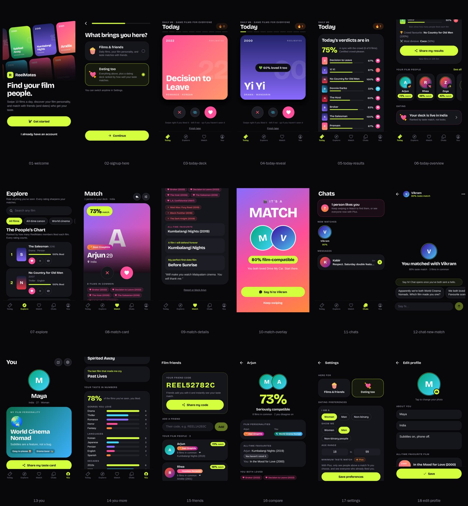

# ReelMates — product & technical README

**ReelMates** is a social film app: swipe today's 10 films, see how everyone else voted, discover your **film
personality**, and find your **film people**. Friends first, dates if you want them. It is native-first (Expo) with an
Express API on Supabase Postgres.



---

## Product

### 1. Sign up

Name, age (18+), country, **Here for** (*Films & friends* or *Dating too*), email + password, terms, and an optional
friend code. People who choose dating also pick *I am* (woman / man / non-binary) and *Show me*. A photo is asked for
last and can be skipped. There is no filler bio.

### 2. Today: the daily drop

- Everyone gets the **same 10 films** each UTC day (`GET /movies/daily` → `{ movies, number }`), so active members
  build up films in common with everyone else.
- Swipe **right = loved it**, **left = nah**, **up = haven't seen** (never counts against anyone). Each swipe reveals
  how the crowd voted ("💚 72% loved Parasite too", "🌶️ Hot take").
- After the last film: **Daily results** (`GET /movies/daily/results`) — how in sync you were with the crowd, the crowd
  favourite, the most divisive film, a countdown to tomorrow's films, and a Wordle-style share text:
  `ReelMates Daily #6 🎬 / 🟩🟥🟩⬜… / Agreed with the crowd on 6/8 · 🔥 4`.
- **Streaks:** days in a row with at least one rating; the evening reminder uses it ("🔥 4-day streak on the line").

### 3. Film personality

Revealed after 8 likes/dislikes: one of 14 archetypes (Hopeless Romantic 💘, Midnight Thrill-Seeker 🔪, Desi
Cinephile 🪔, World Cinema Nomad 🌏, Hidden Gem Hunter 💎, Genre Hopper 🎲…) plus trait chips ("Tough critic 🧐",
"Subtitles on 🌏"). It rewards what is *distinctive* about your taste compared with the catalog, not just big genres.
Shown on You, on friend and match cards, in conversation starters and on the public taste card. See
`docs/design/MATCHING.md`.

### 4. Explore

Search the whole catalog (436 films), rate anything you've seen, and browse the **People's chart** (films ranked by
members) with collections: the canon, world cinema, Indian and Malayalam cinema, crowd favourites, underseen gems…

### 5. Film friends & taste card

- Add anyone by **friend code** (the same code works as a referral at signup). Compare taste, both personalities and
  favourites, and get **Watch together** ideas.
- **Share my taste card** makes `/taste/<code>` public: personality, favourite, rarest loves, top genres and counts.
  No photo, age or location. It can be hidden again.

### 6. Dating (opt-in)

- **Here for** is changeable in Settings (`users.dating_enabled`). Films-only members never appear in decks, need no
  gender, and don't count towards the launch gate. The *Match* tab shows only when dating is on; *Chats* shows once
  dating is live for you and you date (or still have matches).
- **Who you see:** interest has to go both ways (*Show me*). To appear in decks you need a name, a photo and a country.
- **Card:** photo, name, age, place, taste match %, personality, films in common, favourite, up to three prompts, bio.
- **Likes you:** everyone sees how many; **ReelMates Plus** shows who, plus a minimum taste-match filter.
- **Launch gate:** dating opens everywhere when dating-enabled men ≥ target AND women ≥ target (default 500 / 500), and
  in a single country at `country_target` each (default 150) or by hand in `/admin`. Until the global launch, people
  in an open country meet only each other. The app shows the member's country progress, not gender counters.

```env
LAUNCH_MALE_TARGET=500
LAUNCH_FEMALE_TARGET=500
DAILY_MOVIE_COUNT=10
```

To test dating locally, set `FORCE_DATING_OPEN=true` in `.env`: it opens dating for that API instance only and never
touches the shared database. In production, change targets or open dating from `/admin`.

### 7. Chat

- Mutual matches only. **Intro rule:** one hello each; full chat unlocks when both have said hi.
- **Conversation starters** from shared likes and dislikes, favourites, prompts and a shared personality.
- **Block**, **report** and **delete account** everywhere (store safety baseline).

### 8. ReelMates Plus

`users.plus_until` decides access. It is set by the RevenueCat webhook (`POST /api/v1/billing/revenuecat`, header must
equal `REVENUECAT_WEBHOOK_AUTH`; the app must call `Purchases.logIn(user.id)`) or by hand in `/admin`. The in-app
purchase screen is not built yet.

---

## Mobile app tabs

| Tab | What's there | When visible |
|-----|--------------|--------------|
| **Today** | Daily swipe deck, results, your film people, invite, dating status | Always |
| **Explore** | Search, People's chart, collections | Always |
| **Match** | Dating deck, undo, preferences | Dating on |
| **Chats** | Likes you, new matches, threads with unread badges | Dating live for you, and dating on or matches exist |
| **You** | Personality, taste card, stats, favourite, prompts, film friends, Plus, settings | Always |

## Design system

Dark UI with one loud accent (**marquee lime** `#D4FF3F`, always with dark text) and pink / violet / cyan support,
**Bricolage Grotesque** for display type, and typographic genre-gradient posters, so no poster artwork is needed.
Tokens live in `mobile/lib/theme.ts`, mirrored for the web in `src/styles/tokens.css`. Screens:
`docs/design/preview/`.

---

## Architecture

| Layer | Tech |
|--------|------|
| **Mobile (primary)** | Expo 57, React Native, Expo Router — `mobile/` |
| **API** | Express + JWT + bcrypt — `server/` |
| **Database** | Supabase Postgres (project `moviematch`) |
| **Web** | React + Vite — `src/`: landing and sign-up, public taste cards, password reset, `/admin`, an older dashboard |

### Main API routes (`/api/v1`)

| Route | Purpose |
|--------|---------|
| `POST /auth/signup` | Register (here for, optional gender, country, terms, friend code) |
| `GET /auth/me` | Profile + platform status |
| `GET /movies/daily` | Today's films with crowd votes, and the daily number |
| `GET /movies/daily/results` | Agreement with the crowd, favourite, most divisive, share text |
| `POST /movies/:id/rate` | `love` / `hate` / `skip` |
| `GET /users/taste-stats` | Personality, genres, languages, decades |
| `GET/POST /friends`, `GET /friends/compare/:id` | Film friends and taste compare |
| `GET /public/taste/:code` | Public taste card (only when shared) |
| `GET /dating/deck`, `POST /dating/swipe` | Dating deck (dating on, after launch) |
| `GET /dating/matches`, `GET /dating/likes-you` | Matches; who liked you (Plus) |
| `GET/POST /messages/...` | Chat with intro gating |
| `POST /safety/block`, `POST /safety/report`, `DELETE /safety/account` | Safety |

Full list: Swagger UI at `/api/v1/docs`.

### Matching

1. Per-user love / hate sets from every rating; *haven't seen* is ignored.
2. Match % from shared likes and dislikes (rarer films count more), clashes and favourites; it starts at 50% and moves
   as evidence adds up.
3. Deck: dating-enabled people whose *Show me* fits both ways, same country while only that country is open, not yet
   swiped or blocked; sorted by match, then films in common.

Details and formulas: `docs/design/MATCHING.md`. For 10k+ users, precompute candidate pools or move deck generation
to a background job.

---

## Development

```bash
# Install
npm install
cd mobile && npm install

# API + web
cp .env.example .env   # set SUPABASE_* and JWT_SECRET
npm run dev

# Native app (Expo)
npm run server         # terminal 1
cd mobile && npm start # terminal 2 — Expo Go / simulator
```

Checks: `npm test` (API), `npm run mobile:typecheck`, `npm run build` (web), `npm run smoke` (running API).

**Demo users** (local development only; refused when `NODE_ENV=production`):

```bash
DEMO_PASSWORD=pick-one npm run db:seed:demo   # maya@ / anna@ / luca@example.com
npm run db:prelaunch-cleanup -- --yes         # removes them again (run before launch)
```

---

## Production & stores

- **Owner launch guide (start here):** [`LAUNCH_GUIDE.md`](LAUNCH_GUIDE.md) — every account, key and command, in order
- **Launch checklist (status):** `docs/production/LAUNCH_CHECKLIST.md`
- **Architecture / backlog / deploy:** `docs/production/ARCHITECTURE.md`, `BACKLOG.md`, `DEPLOYMENT.md`, `STAGING.md`
- Deploy API over **HTTPS**; set `EXPO_PUBLIC_API_URL` in EAS.
- Run `npm test` in CI; use Docker for API hosting.
- See `docs/store/SUBMISSION_CHECKLIST.md` for Play/App Store steps.
- Legal: `docs/legal/PRIVACY_POLICY.md`, `docs/legal/TERMS_OF_SERVICE.md`.

---

## Database migrations

All in `supabase/migrations/`, applied in order:

- `20261002120000_reelmates_dating_launch_v1.sql` … `20261003220000_launch_readiness_v1.sql` (launch build)
- `20261004120000_favorite_film_and_friends.sql`, `20261004130000_collections_feedback_stats.sql` (v1.3)
- `20261005120000_inclusive_regions_plus.sql` — **not yet applied to moviematch**
- `20261006120000_dating_optin.sql` — **not yet applied to moviematch** (apply after the one above)

Apply the last two before deploying this API: it reads `users.dating_enabled`, `interested_in`, the streak columns and
`plus_until`.

RLS is enabled on every `public` table with no policies, so client keys get no table access. The API must use
`SUPABASE_SERVICE_ROLE_KEY`.

---

## Shipped since v1.0

- Supabase Realtime chat broadcast (`chat:{conversationId}`), with polling as a fallback
- OpenAPI spec and Swagger UI at `/api/v1/docs`
- Manual age/location verification (user request + admin review)
- Inactivity cleanup job (`POST /api/v1/internal/inactivity-cleanup`)
- Integration tests (`npm run test:integration`) and a Maestro smoke flow (`mobile/.maestro/smoke.yaml`)

See `CHANGELOG.md` and `docs/production/BACKLOG.md`.

## What's intentionally out of scope (next passes)

- Letterboxd import and real poster artwork (TMDB) — on hold
- Third-party ID verification vendor (Persona/Onfido), the Plus purchase screen
- Postgres Realtime RLS policies for direct client reads (broadcast is used today)
- Detox suite in CI
